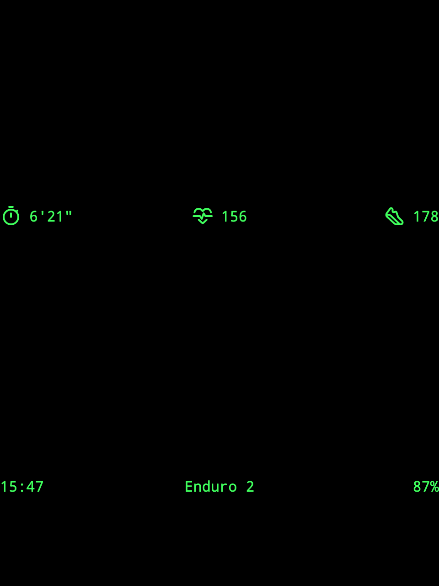

这是一款 Rokid Glasses 应用，用于配合佳明手表显示运动的实时数据。

## UI 视图

- 窗口底部显示的是常规信息，从左到右依次是
  - 当前时间，24小时制；
  - 已连接的佳明设备名称；
  - Rokid Glasses 当前设备电量百分比；
- 窗口左上角是跑步实时数据，从上到下依次是
  - 配速
  - 心率
  - 步频
- 窗口右上角是跑步累计数据，从上到下依次是
  - 距离
  - 用时

UI效果原型参见：[view-480x640](prototype/view-480x640.html)

## 产品特性

基于低功耗蓝牙标准的数据获取，包括但不限于：

- [ ] [Heart Rate Service](https://www.bluetooth.com/specifications/specs/heart-rate-service-1-0/)
- [ ] [Running Speed and Cadence Service](https://www.bluetooth.com/specifications/specs/running-speed-and-cadence-service/)
- [ ] [Cycling Speed and Cadence Service](https://www.bluetooth.com/specifications/specs/cycling-speed-and-cadence-service/)
- [ ] [Cycling Power Service](https://www.bluetooth.com/specifications/specs/cycling-power-service/)
