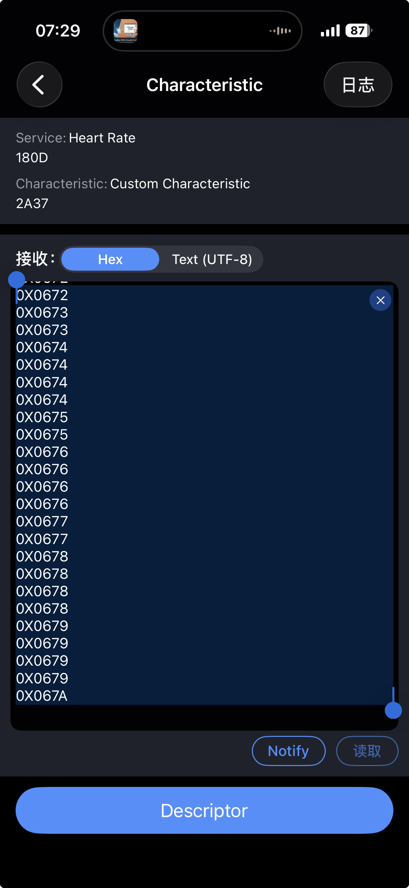

# HRS 二进制协议规范

基于 Bluetooth [HRS (Heart Rate Service) v1.0](https://www.bluetooth.com/specifications/specs/html/?src=HRS_v1.0/out/en/index-en.html) 规范提炼。

---

## 1. 服务与特征 UUID

| 名称 | UUID |
|------|------|
| **Heart Rate Service** | `0x180D` |
| **Heart Rate Measurement** | `0x2A37` |
| **Body Sensor Location** | `0x2A38` |
| **Heart Rate Control Point** | `0x2A39` |

---

## 2. Heart Rate Measurement 数据格式（通知/Notify）

**所有数据采用小端序 (Little Endian)**

### 二进制结构

| 字节偏移 | 字段 | 类型 | 说明 | 单位 |
|:---:|------|------|------|------|
| 0 | `Flags` | UINT8 | 标志位（见下表） | - |
| 1-2 | `Heart Rate Value` | UINT8/UINT16 | **条件格式**（Flags Bit 0 决定） | bpm |
| 2-3 | `Energy Expended` | UINT16 | **条件字段**（Flags Bit 3=1 时存在） | 千焦 (kJ) |
| 4+ | `RR-Interval` | UINT16[] | **条件字段**（Flags Bit 4=1 时存在，可包含多个值） | 1/1024 秒 |

### Flags 字段位定义（字节 0）

| Bit | 名称 | 含义 |
|:---:|------|------|
| 0 | Heart Rate Value Format | `0` = UINT8 格式, `1` = UINT16 格式（连接期间可变） |
| 1 | Sensor Contact Status | `0` = 无/皮肤接触差, `1` = 检测到良好接触 |
| 2 | Sensor Contact Support | `0` = 不支持接触检测, `1` = 支持（连接期间静态） |
| 3 | Energy Expended Status | `0` = 不包含, `1` = 包含该字段 |
| 4 | RR-Interval | `0` = 不包含, `1` = 包含一个或多个值 |
| 5-7 | Reserved (RFU) | 必须置 0 |

### Heart Rate Value 字段规则

- **≤255 bpm**: 推荐使用 UINT8 格式（Flags Bit 0=0）
- **>255 bpm**: 强制使用 UINT16 格式（Flags Bit 0=1）

### Energy Expended 字段规则

- 达到 `0xFFFF` 时保持该值，提示客户端需复位
- 可通过 Heart Rate Control Point 写入 `0x01` 清零

### RR-Interval 字段规则

- 每个子字段为 UINT16，单位 `1/1024 秒`
- 在 23 字节 ATT_MTU 下，最多可包含 7~9 个值（取决于 HR 值格式与 Energy Expended 是否存在）
- 超出缓冲时可丢弃最旧数据

### 示例解析

```
原始数据: 0x06 0x72
          │    └─ Heart Rate Value: 0x72 = 114 bpm (UINT8 格式)
          └─ Flags: 0x06 = 0b00000110
                    Bit 1=1: 传感器接触良好
                    Bit 2=1: 支持接触检测
```

---

### 来自佳明手表实际数据解析示例



截图展示了通过 BLE 调试工具接收到的佳明手表 Heart Rate Measurement 通知数据。

**原始数据**（每条 2 字节，Flags=0x06 表示仅包含基础心率值且传感器接触良好）:

```
0X0672
0X0673
0X0673
0X0674
0X0674
0X0674
0X0674
0X0674
0X0675
0X0675
0X0676
0X0676
0X0676
0X0676
0X0677
0X0677
0X0678
0X0678
0X0678
0X0678
0X0679
0X0679
0X0679
0X0679
0X067A
```

**逐条解析**:

| 原始数据 | Flags | HR Value (Hex) | Heart Rate (bpm) | 传感器状态 |
|----------|-------|----------------|------------------|------------|
| `0X0672` | 0x06 | 0x72 | 114 | 接触良好 |
| `0X0673` | 0x06 | 0x73 | 115 | 接触良好 |
| `0X0674` | 0x06 | 0x74 | 116 | 接触良好 |
| `0X0675` | 0x06 | 0x75 | 117 | 接触良好 |
| `0X0676` | 0x06 | 0x76 | 118 | 接触良好 |
| `0X0677` | 0x06 | 0x77 | 119 | 接触良好 |
| `0X0678` | 0x06 | 0x78 | 120 | 接触良好 |
| `0X0679` | 0x06 | 0x79 | 121 | 接触良好 |
| `0X067A` | 0x06 | 0x7A | 122 | 接触良好 |

